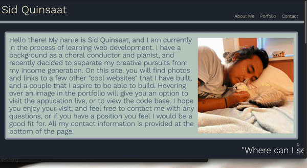
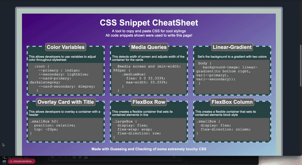

# CSS Portfolio

## Description 

The goal of this project is to create a responsive and informative portfolio page in order to showcase previously completed web applications. The webpage had certain specifications that needed to be met, which inclded the following points:

* [A responsive layout that adapts to the viewport](#responsive-layout)
* [A portfolio of previous work, with photos and links to live applications](#portfolio)

## Link and preview of the site. 

[Click to view the website](https://sharkby7e.github.io/CSSportfolio/)



## Key features of application

### Responsive Layout
I want to make sure that the website is viewable on any sort of screen. In oder to achieve this, I used CSS media queries, as well as proportional sizing for my fonts.  

```css
@media screen and (max-width: 968px) {
  #aboutMe p {
    font-size: 3vw
  }

  .lilProjCard {
    max-width: 98%;
    margin: 1%;
  }

  #contact a {
    font-size: 1.5vw
  }

  #contact p {
    font-size: 1.5vw
  }

}
```

This ensures that content will adjust to fit whatever viewport the page is loaded on.
### Portfolio
The main purpose of this page is to showcase my previous web applications. I included photos, as well as links to the website, and the codebase. In order to add some interest to the page, I made it such that when you hover over the image of the website, the image is obscured to reveal the relevant links. 

 

## Summary
This website hopefully showcases the current level of my skills, and I hope to look back at it in a few weeks to see my improvements as well.  
